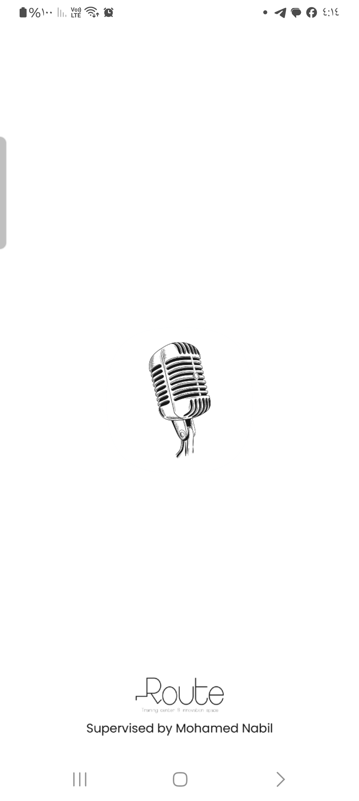
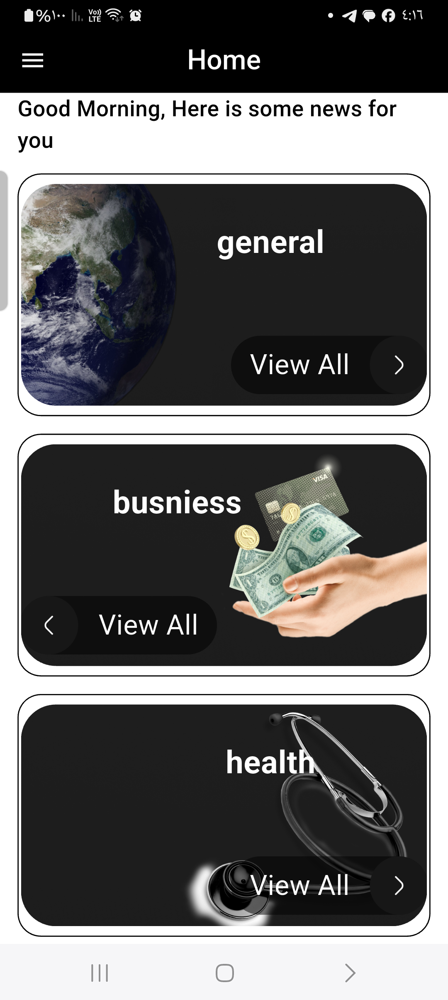
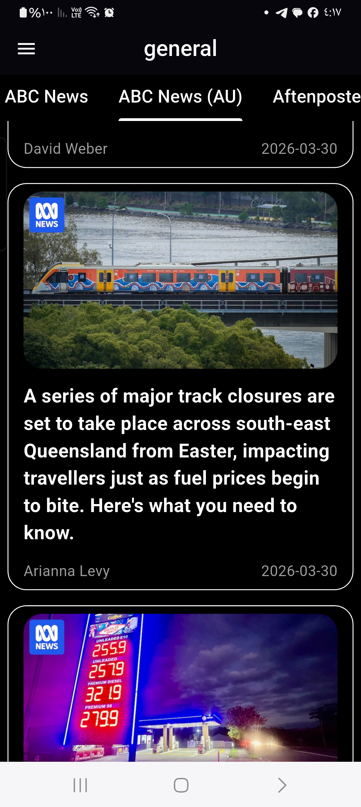
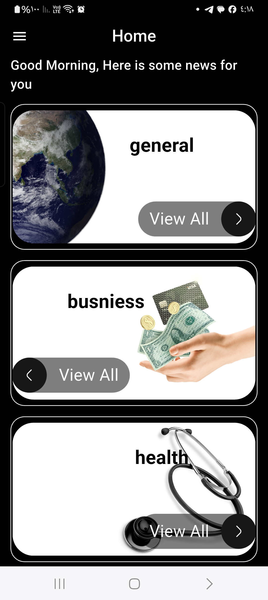

# 📰 News App (C17)

A robust, modern News application built with **Flutter**. This project demonstrates an advanced implementation of **Clean Architecture** and **Reactive Programming**, offering a seamless news reading experience with offline support and multi-language capabilities.

---

## 📸 Screenshots Showcase

The app provides a clean, user-centric interface for browsing global news categories and reading detailed articles via an integrated web experience.

### 🌟 App Experience
| splash  | light
| :---: | :---: | :---: |
|  |

| Home Dashboard | News Categories | Article Details (WebView) |
| :---: | :---: | :---: |
|  |  

### 🛠 Offline & Localization
| News Functionality |
| :---: | :---: | :---: |
|  |  

---

## ✨ Key Technical Features

* **📦 State Management (Bloc):** Implements **flutter_bloc (9.1+)** for predictable state changes and clean UI-Logic separation.
* **💉 Dependency Injection:** Utilizes **Injectable** and **Get_It** for automated and scalable service management.
* **🌐 Advanced Networking:** Powered by **Dio** with **Pretty Dio Logger** for professional API debugging and request handling.
* **💾 Local Persistence (Hive):** High-performance NoSQL storage for caching news articles and enabling **Offline Mode**.
* **🌍 Internationalization:** Seamlessly localized in multiple languages using **Easy Localization**.
* **🚀 Performance & UX:**
  * **Cached Network Image:** Smooth image loading with fallback placeholders.
  * **Connectivity Plus:** Real-time monitoring of network status.
  * **WebView Integration:** Read full articles directly within the app.

---

## 🛠 Tech Stack

* **Logic:** `flutter_bloc`, `build_runner`.
* **DI:** `get_it`, `injectable`, `injectable_generator`.
* **Data:** `dio`, `hive`, `hive_flutter`.
* **UI/UX:** `cached_network_image`, `webview_flutter`, `flutter_native_splash`.

---

## 🚀 Installation & Build

1. **Clone the repository:**
   ```bash
   git clone [https://github.com/Mohamed-Hessein/news_app.git](https://github.com/Mohamed-Hessein/news_app.git)
